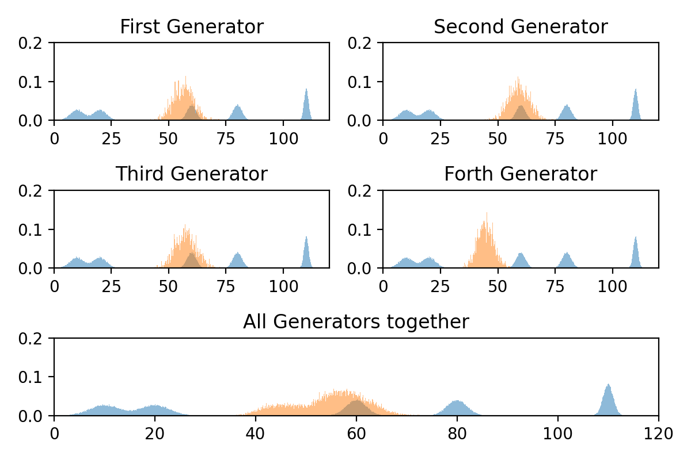

# MAD-GAN
TensorFlow implementation of Multi-Agent Diverse Generative Adversarial Network (MAD-GAN) In three different datasets:
* A distribution of 1D GMM having five mixture components with modes at 10, 20, 60, 80 and 110, and standard
deviations of 3, 3, 2, 2 and 1, respectively.
* A distribution of 2D GMM having six mixture components with modes at circumference of a cricle with radius of 5
* MNIST dataset

# Results

# Resources
* [Ghosh, Arnab, et al. "Multi-agent diverse generative adversarial networks." Proceedings of the IEEE Conference on Computer Vision and Pattern Recognition. 2018.](http://openaccess.thecvf.com/content_cvpr_2018/papers/Ghosh_Multi-Agent_Diverse_Generative_CVPR_2018_paper.pdf)
